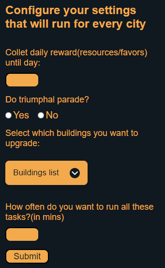

# Lazy

### This is a bot for the online game Grepolis. It's main purpose is to automate some boring repetitive tasks from the game. The bot is an chrome extension made with javascript.

### You can install it by going to chrome extensions and add the folder "lazy" as an unpacked extesion. After that you can click on the extension's icon to configure it. The configuration window looks like this:

### We can add many improvements(better timing, add new features, use requests and not object.click and so on...) but this project was oriented more towards learning. But besides that it also have some limitations, for example we can't extract the window values to make some new features.So, for now I will no longer work on improvements.